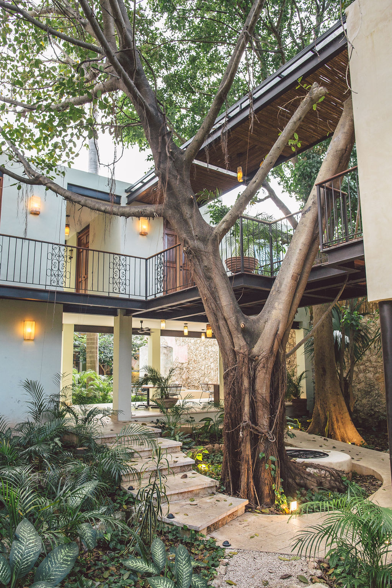
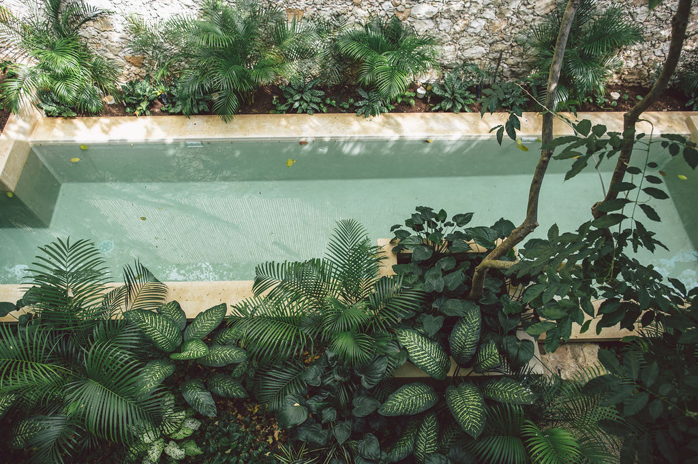

# Tree House V1 — Round 3 Critique
**Focus:** motion, interaction, polish, accessibility, edge cases.
**Method:** read-only. Two files of context (R1/R2 critiques, REVISIONS, PHOTO_MANIFEST) consumed. Findings numbered. No file edits.

R1 hit hierarchy. R2 hit voice. R3 finds the page is beautifully composed but **breaks hard without JS, swallows screen readers on its three best Spanish moments, and leaves several of R2's own R3-backlog items unimplemented.** The cinematic chrome works; the wiring under it is half-wired.

---

## 1. CRITICAL — Page is unusable without JavaScript

**What.** `index.html` line 23: `<body style="overflow: hidden;">`. JS removes this at 1300ms inside `main.js:19`. The intro overlay (z-index 99999, pointer-events:none) sits over the page until JS adds `.dissolved` at 1300ms and `display:none` at 2400ms (`main.js:17,23`). No `<noscript>` fallback. If JS is blocked, fails to parse, or any earlier statement throws — overlay stays opaque, body stays `overflow:hidden`, page is permanently unscrollable and the user sees only the wordmark.

**Why.** A luxury hotel site must be operable to a Googlebot, a print stylesheet, a reader that's stripped scripts, or a corporate proxy that timed JS out. Accessibility (WCAG 4.1.1 robustness) and SEO both fail this.

**Fix.** Move the inline `overflow:hidden` to a CSS class applied by JS (`.js .body--locked` or similar), and add a noscript escape hatch:

```html
<head>
  ...
  <noscript>
    <style>
      .intro-overlay { display: none !important; }
      body { overflow: auto !important; }
      .cursor, .cursor-trail { display: none !important; }
    </style>
  </noscript>
</head>
```

And remove the inline `style="overflow: hidden;"` from `<body>` — set it via a class:
```js
document.body.classList.add('js-locked');
setTimeout(() => document.body.classList.remove('js-locked'), 1300);
```
```css
body.js-locked { overflow: hidden; }
```

Also add a CSS-only intro auto-dissolve as a belt-and-braces fallback:
```css
@keyframes introAutoFade { 0%, 80% { opacity: 1 } 100% { opacity: 0; visibility: hidden } }
.intro-overlay { animation: introAutoFade 2.6s ease forwards 0.8s; }
.intro-overlay.dissolved { animation: none; opacity: 0; }
```
The JS `.dissolved` class still wins when JS runs; otherwise the animation gets there on its own.

---

## 2. CRITICAL — Three load-bearing Spanish moments are invisible to screen readers

**What.** R2's headline copy moves — the interstitial pull-quote (`index.html:668`), the breath quote (`index.html:225`), and the entire art marquee (`index.html:407`) — sit inside `<section aria-hidden="true">` or `<div aria-hidden="true">`. The Spanish *"No hay recepción. Hay alguien que ya sabe en qué silla cae la última luz."* — REVISION_R2 calls this "the closest cheap substitute" for a paired-language Sanctuary — is announced to screen readers as exactly nothing.

**Why.** `aria-hidden="true"` removes the element and all its descendants from the accessibility tree. Decorative containers are fine to hide; a section whose entire content is the page's most considered prose is not decorative. R2 documented these as load-bearing (Finding #11). R3 must surface them.

**Fix.** Drop the `aria-hidden="true"` on `.section-breath`, `.section-interstitial`. Keep it on `.art-marquee` (purely repeating chrome). For the interstitial, mark the Spanish phrase with `lang="es"` and use the English gloss as actual prose (not aria-decoration):
```html
<section class="section-interstitial">
  <div class="interstitial-bg" aria-hidden="true">…</div>
  <div class="interstitial-overlay" aria-hidden="true"></div>
  <blockquote class="interstitial-content reveal">
    <p class="pull-quote" lang="es">"No hay recepción. <em>Hay alguien que ya sabe en qué silla cae la última luz.</em>"</p>
    <p class="interstitial-attr"><span class="visually-hidden">English: </span>No front desk. Someone who already knows which chair the last light falls on.</p>
  </blockquote>
</section>
```

---

## 3. CRITICAL — Zero `lang="es"` markers; brief explicitly required them

**What.** Brief item 11 specifies "lang=es markers on Spanish — R2 added 3 load-bearing Spanish moves." Page has **none**. Searches show 15+ Spanish strings: section labels (`El Refugio Botánico`, `Las Habitaciones`, `La Llave Michelin`, `La Rotación Actual`, `El Diario`, `Mérida a tu medida`, `Las Voces`, `El Sitio · Calle 43`, `Las Ofertas`), the interstitial pull-quote, the rotation name (`Bajo el Dosel`), the journal-card phrase (`se acaba cuando se acaba`, line 503), the footer Spanish flourish (line 791), the testimonial label suffix (`Notas escritas al partir`), and the curated tags (`Luna de Miel`, `Expediciones`).

**Why.** Screen readers default to the document's `lang="en"` and will mispronounce all of it ("La Habitacioness", "Sair-veh"). WCAG 3.1.2 (Language of Parts) is failed.

**Fix.** Wrap every Spanish string in `lang="es"`. For Spanish phrases inside English prose, on the inline element:
```html
<em lang="es">se acaba cuando se acaba</em>
<span class="label" lang="es">El Refugio Botánico</span>
<span class="label" lang="es">Mérida a tu medida</span>
<p class="pull-quote" lang="es">"No hay recepción..."</p>
```
Don't put `lang="es"` on `<section>` — the surrounding English label/prose is English. Tag the inline span.

---

## 4. CRITICAL — Touch devices keep `cursor: none` on every interactive button

**What.** `body { cursor: none }` (line 79) cascades to all children. Many interactives explicitly re-state `cursor: none` (`.hero-cta a.magnetic-btn` line 749, `.nav-dot` 253, `.room-card` 1245, `.testimonial-dot` 2030, `.journal-card` 1705, `.reserve-submit` 2366, `.location-cta a` 2190, `.scroll-to-top` 2549, `.top-nav .logo` 392, `.footer-brand .logo` 2415, `.reserve-field input/select` 2346). At `max-width: 768px` the reset is:
```css
@media (max-width: 768px) {
  body { cursor: auto; }
  button, a, input, select { cursor: pointer; }
}
```
But `.hero-cta a.magnetic-btn { cursor: none }` has **higher specificity** than `a { cursor: pointer }` and comes earlier in source; the media-query rule loses the cascade because of specificity, not source order. Same for every other class+element selector above. Result: on a phone, the buttons silently keep `cursor: none`. The native pointer cursor (or focus ring proxy on touch) is hidden.

This also bites **iPad / Surface in laptop posture** (window >768px but pointer is coarse via touch). The JS gates the custom `.cursor` div on `(pointer: fine)`, so an iPad-with-touch gets no custom cursor *and* the native cursor is hidden by CSS. When the user plugs in a trackpad, they get a missing cursor over every button.

**Why.** Pointer-coarse devices need their native pointer back. Selector specificity is wrong way around.

**Fix.** Use a `coarse` media query, not `max-width`, and use `:where()` (zero specificity) on the custom-cursor rules so the reset wins:

```css
@media (hover: hover) and (pointer: fine) {
  body { cursor: none; }
  :where(.hero-cta a.magnetic-btn, .nav-dot, .room-card, .testimonial-dot,
         .journal-card, .reserve-submit, .location-cta a, .scroll-to-top,
         .top-nav .logo, .footer-brand .logo, .reserve-field input, .reserve-field select) {
    cursor: none;
  }
}
@media (hover: none), (pointer: coarse) {
  body, button, a, input, select { cursor: auto; }
  .cursor, .cursor-trail { display: none !important; }
}
```

Same problem also disables `magnetic-btn` and ripple-handlers on touch correctly (JS gates on `pointer: fine`) — good. The CSS is the only fix needed.

---

## 5. MAJOR — Smooth scroll lands underneath the fixed top-nav (no `scroll-padding-top`)

**What.** `top-nav` is `position: fixed; padding: 22px 44px` (≈80px tall, ≈54px scrolled), and `html { scroll-behavior: smooth }` is set, plus JS does `scrollIntoView({behavior:'smooth'})` on every anchor click (`main.js:154, 325`). Neither uses any offset. A click on "Sanctuary" lands the section's top **underneath** the nav by ~80px; the section eyebrow is cropped.

**Why.** Every in-page jump (skip-link, nav-dots, top-nav links, footer columns, hero CTAs) lands ugly. WCAG 2.4.4 + 2.4.7 mean the destination should be visible and unobstructed.

**Fix.**
```css
html { scroll-padding-top: 100px; }
@media (max-width: 1100px) { html { scroll-padding-top: 72px; } }
@media (max-width: 480px)  { html { scroll-padding-top: 60px; } }

/* Respect reduced motion explicitly — scroll-behavior is NOT covered
   by the global transition-duration override */
@media (prefers-reduced-motion: reduce) {
  html { scroll-behavior: auto; }
}
```

And in JS, replace `el.scrollIntoView({behavior:'smooth'})` with a guarded version:
```js
const reduceMotion = window.matchMedia('(prefers-reduced-motion: reduce)').matches;
el.scrollIntoView({ behavior: reduceMotion ? 'auto' : 'smooth' });
```

---

## 6. MAJOR — Auto-rotating testimonial carousel: no pause-on-hover, no pause-on-focus, no aria-live, no prev/next, fixed dwell (R2 backlog #4)

**What.** `main.js:288` starts `setInterval(nextTestimonial, 5500)` and never pauses for hover, focus, visibility (tab change), or keyboard interaction. No `aria-live` on `.voices-content` or `.testimonial-item` (`index.html:613-650`). The five testimonials run from a 1-line quote ("Best hotel breakfast in México. That's the whole review.") to a 4-line quote (Iris / Copenhagen) — REVISION_R2 §73 explicitly flagged this as the R3 motion tweak. Still 5500ms for all.

**Why.** WCAG 2.2.2 (Pause, Stop, Hide): auto-updating content longer than 5s needs a user-accessible pause. The one-liner whips past before a slow reader finishes; the long Iris quote disappears mid-sentence for a fast skimmer. Screen reader users get five sudden swaps with no announcement.

**Fix.**

Mark the region:
```html
<div class="voices-content" role="region" aria-roledescription="testimonial carousel"
     aria-label="Guest voices" aria-live="polite" aria-atomic="false">
  …
</div>
```
Each testimonial: `<blockquote class="testimonial-item" aria-hidden="true">` (active one: drop the aria-hidden, or toggle in JS).

Vary dwell time per content length:
```js
function dwellMsFor(item) {
  const chars = (item.textContent || '').trim().length;
  // ~50 chars/sec reading + a beat — ranges roughly 4.5s ↔ 9s
  return Math.min(9000, Math.max(4500, 2200 + chars * 28));
}
function scheduleNext() {
  clearTimeout(testimonialTimer);
  testimonialTimer = setTimeout(nextTestimonial, dwellMsFor(testimonials[currentTestimonial]));
}
```
(Swap `setInterval` for the self-rescheduling `setTimeout` so each dwell is computed against the *new* item.)

Pause on hover/focus inside `.voices-content`, and on tab-hidden:
```js
const voices = document.querySelector('.voices-content');
voices.addEventListener('mouseenter', () => clearTimeout(testimonialTimer));
voices.addEventListener('mouseleave', scheduleNext);
voices.addEventListener('focusin', () => clearTimeout(testimonialTimer));
voices.addEventListener('focusout', scheduleNext);
document.addEventListener('visibilitychange',
  () => document.hidden ? clearTimeout(testimonialTimer) : scheduleNext());
```

Keyboard prev/next — add ←/→ when the carousel region has focus:
```js
voices.addEventListener('keydown', (e) => {
  if (e.key === 'ArrowRight') { clearTimeout(testimonialTimer); nextTestimonial(); }
  if (e.key === 'ArrowLeft')  { clearTimeout(testimonialTimer);
    showTestimonial((currentTestimonial - 1 + testimonials.length) % testimonials.length);
    scheduleNext();
  }
});
```

And honor `prefers-reduced-motion` by disabling auto-advance entirely:
```js
if (window.matchMedia('(prefers-reduced-motion: reduce)').matches) {
  // user controls; do not auto-rotate
} else {
  showTestimonial(0); scheduleNext();
}
```

---

## 7. MAJOR — Parallax + scroll-driven transforms ignore `prefers-reduced-motion`

**What.** `updateParallax()` in `main.js:234-242` writes `transform: translateY(...) scale(1.05)` to `.sanctuary-image-wrap img` on every scroll frame, unconditional. The CSS reduced-motion block at line 2587 sets `transition-duration: 0.01ms` but transforms applied via `element.style.transform` don't transition — they apply immediately. Reduced-motion users still get full parallax. Same applies to `cursor-trail` rAF loop in `animateTrail()` (`main.js:42-48`) — runs forever.

**Why.** WCAG 2.3.3. Vestibular-disorder users requested reduction; the page doesn't honor it where it matters most.

**Fix.** Top of the IIFE:
```js
const reduceMotion = window.matchMedia('(prefers-reduced-motion: reduce)');
let prefersReducedMotion = reduceMotion.matches;
reduceMotion.addEventListener('change', e => { prefersReducedMotion = e.matches; });
```
Then in `updateParallax`:
```js
function updateParallax() {
  if (prefersReducedMotion) { sanctuaryImg.style.transform = ''; return; }
  …
}
```
And gate the trail rAF and the hero ken-burns scale on the same flag:
```js
if (heroBg && !prefersReducedMotion) heroBg.classList.add('loaded');
// otherwise leave at scale(1) by default — see fix #10
```

---

## 8. MAJOR — Reduced-motion breaks marquee & ken-burns in two opposite ways

**What.** The global `@media (prefers-reduced-motion: reduce)` rule (line 2587):
```css
*, *::before, *::after {
  animation-duration: 0.01ms !important;
  transition-duration: 0.01ms !important;
  animation-iteration-count: 1 !important;
}
```
This kills the marquee (`.art-marquee-track` line 1493 + `.photo-strip-track` line 1889) by making infinite scroll complete in 0.01ms with iteration-count 1 — track ends parked at `translateX(-50%)`. The duplicated content makes the photo strip *look* static and full — by accident — but the art marquee text strip may show partial wrap. More importantly, the hero ken-burns is a `transition` on `.hero-bg img { transition: transform 9s ease-out }` — when the `.loaded` class is added at 900ms, the scale snaps `1.12 → 1` in 0.01ms. User sees image at 1.12 for 900ms, then a hard pop. Distracting on its own.

**Why.** Reduced-motion shouldn't replace motion with *flickers*; it should replace it with stable, static content.

**Fix.**
```css
@media (prefers-reduced-motion: reduce) {
  .art-marquee-track,
  .photo-strip-track {
    animation: none;
    transform: none;            /* anchor at start */
  }
  /* Hero starts at final scale, no transition needed */
  .hero-bg img { transform: none !important; transition: none !important; }
  .hero-bg.loaded img { transform: none !important; }

  /* Don't run the canopy breathing background (already partly handled) */
  .canopy-tint { animation: none !important; opacity: 0.85; }

  /* Cursor trail isn't useful when motion is off — hide */
  .cursor-trail { display: none !important; }
}
```

---

## 9. MAJOR — Skip link points to `#sanctuary`, not `<main>`; no `<main>` exists

**What.** Line 26: `<a href="#sanctuary" class="skip-link">Skip to content</a>`. There is no `<main>` element anywhere in the document. The skip target is the *second* section, which means keyboard users skip the hero on every page load. R1/R2 made the hero the page's most loaded moment (title, eyebrow, tagline, badge, meta, CTAs) — skipping it is the wrong default.

Also, the inner `<nav>` in the header (line 81) has no `aria-label`, so a screen reader reads it as the same "navigation" landmark as the nav-dots (which IS labeled). Two unnamed landmarks = orientation confusion.

**Why.** WCAG 2.4.1 (Bypass Blocks) wants a skip to *main content*, not a skip past it. Landmark labelling matters when there are multiple of a kind.

**Fix.**
```html
<a href="#main" class="skip-link">Skip to content</a>
…
<header class="top-nav">
  …
  <nav aria-label="Primary">
    <ul class="nav-links">…</ul>
  </nav>
</header>

<main id="main">
  <section class="section-hero" id="hero" data-section="hero">…</section>
  …all current sections…
</main>
```
And while there, change `<section class="section-footer">` to `<footer class="section-footer">` or move the `<footer>` out of the section, since semantically that wrapper IS the footer landmark.

---

## 10. MAJOR — Reserve-form fake-submit has no `aria-live`; status invisible to AT

**What.** `main.js:330-345`. On submit, button text swaps to "Enquiry sent" and background turns leaf-bright. There's no `aria-live`, no `role="status"`, no visible region outside the button. A screen-reader user pressing Enter on the submit hears nothing; if focus is still on the button they MAY get a re-read on the next refresh, but it's unreliable. Also the email link at `offers-direct` is the actual escape hatch when the fake submit hides reality.

Also: `<input type="date">` has no `min` so a guest can pick yesterday for arrival; departure has no relationship to arrival; submit reports success regardless.

**Why.** A11y + UX. WCAG 4.1.3 (Status Messages).

**Fix.**

```html
<form class="reserve-form" aria-label="Reservation enquiry">
  <div class="reserve-field">
    <label for="arrival">Arrival</label>
    <input type="date" id="arrival" name="arrival" required>
  </div>
  …
  <button type="submit" class="reserve-submit magnetic-btn">Write to the house →</button>
</form>
<p class="reserve-status visually-hidden" role="status" aria-live="polite"></p>
```
```js
const status = document.querySelector('.reserve-status');
reserveForm.addEventListener('submit', (e) => {
  e.preventDefault();
  const arrival = document.getElementById('arrival').value;
  const departure = document.getElementById('departure').value;
  if (arrival && departure && departure <= arrival) {
    status.textContent = 'Please select a departure after your arrival.';
    return;
  }
  submit.textContent = 'Enquiry sent';
  submit.style.background = 'var(--leaf-bright)';
  status.textContent = 'Thank you — we will write back from reservations@treehouseboutiquehotel.com within a day.';
  setTimeout(() => { submit.textContent = original; submit.style.background = ''; }, 3500);
});
```

Also set `min` on `#arrival` from today on page load, and on `#departure` when arrival changes.

---

## 11. MAJOR — Magnetic transform conflicts with submit-button width on mobile

**What.** `.reserve-submit` is `magnetic-btn`. On `max-width: 900px` the reserve form stacks vertically and the submit becomes `width: 100%; padding: 18px` (line 2654). On mobile-but-fine-pointer (rare but happens — Galaxy Fold open, Surface in portrait), the JS magnetic handler is still active because it gates only on `(pointer: fine)`. Hovering pulls the 100%-width button up to ±6px in both axes — a full-width button that visibly wobbles. On the curated rounded corners of the form border, it crosses outside the form.

R2 backlog #6 specifically asked: "verify the reserve form layout doesn't break on narrower viewports." Verified — it doesn't break, but the magnetic pull on a full-bleed submit feels uncalibrated.

**Why.** The magnetic affordance is meant for inline buttons with margin around them, not slab-width form CTAs.

**Fix.** Exclude full-bleed buttons from the magnetic class on narrow viewports:
```js
function magneticEligible(btn) {
  if (!window.matchMedia('(pointer: fine)').matches) return false;
  if (window.matchMedia('(max-width: 900px)').matches && btn.classList.contains('reserve-submit')) return false;
  return true;
}
magneticBtns.forEach(btn => {
  if (!magneticEligible(btn)) return;
  // …existing handlers
});
```
Or simpler: drop `magnetic-btn` from `.reserve-submit` and keep it on the hero/location CTAs only. The ripple is what the form button actually wants.

---

## 12. MAJOR — Custom cursor inline-style inversion fights `.hover` state via specificity

**What.** `main.js:71` sets `cursor.style.background = 'var(--ochre)'` on image-container `mouseenter`. `main.js:56` adds class `.cursor.hover` on interactive `mouseenter`. CSS rule `.cursor.hover { background: var(--ivory) }` (line 169) loses to inline `style.background` (inline always wins in cascade except `!important`). Many interactives are nested inside image containers: `.journal-card` contains `.journal-card__img`; `.room-card` contains `.room-card-bg`; `.art-piece` contains `.art-piece-img`. When the user hovers the card, both mouseenters fire — the image-container's inline `ochre` overrides the `.hover` ivory state.

The bigger issue: when the user leaves the image container but stays on the card, the trail clear (`mouseleave: cursor.style.background = ''`) fires — clearing inline — and `.hover` class is still applied, so it reverts to ivory. So the cursor flickers ochre → ivory → ochre as the pointer crosses the image edge.

**Why.** A custom cursor is supposed to be the calmest thing on the page.

**Fix.** Don't use inline `style.background`; toggle a class:
```js
imageContainers.forEach(el => {
  el.addEventListener('mouseenter', () => cursor.classList.add('over-image'));
  el.addEventListener('mouseleave', () => cursor.classList.remove('over-image'));
});
```
```css
.cursor.over-image { background: var(--ochre); }
.cursor.over-image.hover { background: var(--limestone); }  /* explicit precedence */
```

---

## 13. MAJOR — Art-piece captions misrepresent what the image shows

**What.** Section 5 "La Rotación Actual" attaches three artist captions to three photos:
- N° 01 — Mariana Cárdenas — *"Oil & copal on linen"* — but the image (`art-bar-figurines.jpg`) shows bar shelving with **bronze figurines** (per PHOTO_MANIFEST). The alt text correctly describes the photo; the caption describes a painting that isn't visible.
- N° 02 — Tomás Pérez Caín — *"Stoneware, henequen ash"* — paired with `art-chair-tableau.jpg` (mid-century chairs + eucalyptus posy). No stoneware in frame.
- N° 03 — Lucía Pat Castro — *"Silver gelatin print, ed. of 6"* — paired with `editorial-eucalyptus.jpg` (glass cube of eucalyptus on tile). Not a photograph print.

**Why.** R2's voice is "specifics over abstractions" (REVISION_R2 §41). Inventing an oil-on-linen credit under a photo of figurines reads as fictional. Acceptable as a stand-in if the rotation hasn't shipped yet, but if a real visitor sees "Silver gelatin print" and the image is of eucalyptus, the page is lying about its own art programme. R1/R2 critics didn't flag this because PHOTO_MANIFEST.md hadn't merged at their time.

**Fix.** Either:
(a) ship with placeholder credits explicitly: change captions to describe the *photo* (e.g. *"Treehouse × SoHo · Bar wall, Rotation V"*) and add a one-line "Artist credits to follow" note in the deck; or
(b) re-shoot to capture the actual rotation pieces and re-attach the artist names. The current pairing is the worst of both options — credentialed but unverifiable.

---

## 14. MAJOR — Nav-dot scroll-spy uses `offsetTop` instead of `getBoundingClientRect()`, and is off when sections shrink/stack

**What.** `main.js:138-148`:
```js
function updateNavDots() {
  const scrollCenter = window.scrollY + window.innerHeight / 2;
  sections.forEach((section, i) => {
    const top = section.offsetTop;
    const bottom = top + section.offsetHeight;
    …
  });
}
```
`offsetTop` is relative to the section's `offsetParent`, NOT the document. Most sections here are direct children of `<body>` so it works *by coincidence*. But `.section-rooms` (rooms grid) is preceded by `.rooms-header` and both target `#rooms` — only `.section-rooms` has `data-section`. Nav-dot for "Rooms" thus activates only while the user is in the grid, not on the heading immediately above.

Also: nothing rescues this on viewport resize (no `window.addEventListener('resize', updateNavDots)`). After resize-induced reflow the cached `offsetTop` values aren't cached — they're re-read each scroll — so resize handling is *accidentally* OK. Still, switch to rect to be unambiguous:

**Fix.** Switch to bounding-rect, which is always document-position-relative on top-level elements once you add `scrollY`:
```js
function updateNavDots() {
  const center = window.innerHeight / 2;
  let activeIdx = 0;
  sections.forEach((section, i) => {
    const r = section.getBoundingClientRect();
    if (r.top <= center && r.bottom > center) activeIdx = i;
  });
  navDots.forEach((d, i) => d.classList.toggle('active', i === activeIdx));
}
```

And to bring the rooms-header in: add `data-section="rooms"` to the `.rooms-header` wrapper instead of / in addition to `.section-rooms`, and dedupe the count to keep nav-dots aligned. (One target per nav-dot; the closest one in the document order wins.) If keeping the grid as the data-section element, at minimum bring the header inside it:
```html
<section class="section-rooms-wrap" id="rooms" data-section="rooms">
  <div class="rooms-header"> … </div>
  <div class="rooms-grid"> …existing room cards… </div>
</section>
```

---

## 15. MAJOR — No image `width`/`height` attributes; lazy-loading is good but CLS protection is implicit

**What.** Every `` lacks intrinsic `width`/`height` attributes. CLS is mostly *prevented* because the parent containers fix the aspect ratio in CSS (`.art-piece-img { aspect-ratio: 4 / 5 }`, `.journal-card__img { aspect-ratio: 16 / 10 }`, hero/sanctuary use `height:100%` inside fixed-height parents). But **photo-strip-item** uses `width: 32vw; height: 100%` where 100% is `.section-photo-strip { height: 30vh }` — the image's natural aspect ratio matters when CSS hasn't constrained both axes. Object-fit:cover saves it visually; CLS is still better measured by the browser with intrinsic dims.

Also lazy-loading is applied uniformly via `loading="lazy"`. Some below-fold heroes (e.g. the .voices-bg, .offers-bg, .interstitial-bg, .breath-bg, .michelin-bg, .art-hero-bg) are large full-bleed images — first paint won't load them, which is correct — but the browser doesn't know aspect ratio for them either; the CSS keeps them in absolute positioning containers so no shift.

**Why.** Lighthouse will mark "Image elements do not have explicit width and height" for every photo. Easy win.

**Fix.** Add intrinsic dimensions matching the source files. Examples:
```html



```
Add `fetchpriority="high"` on hero, `decoding="async"` on the rest.

---

## 16. MAJOR — Sanctuary three-paragraph rhythm + soft rule (R2 backlog #2) — not applied; Michelin cell 03 slighter (R2 backlog #3) — not applied

**What.** REVISION_R2 §70-71 explicitly punted these to R3.

(a) Sanctuary now has three body paragraphs (`.sanctuary-content .body-large` × 3 in `index.html:146-154`). CSS just gives each `margin-bottom: 1.4rem`. The third paragraph (adults-only voice) is tonally a shift — R2 wanted "a soft rule between p2 and p3 (the adults-only paragraph) to mark the tonal shift." None present.

(b) Michelin cell 03 is one short sentence; cells 01 and 02 are five-sentence paragraphs. Visual weight in the grid is identical — three equal columns. R2 asked cell 03 to "sit visually slighter." Current CSS gives all three identical treatment (line 1104).

**Why.** R2 reviser flagged these specifically. R3 owns them.

**Fix.**

For Sanctuary:
```css
.sanctuary-content .body-large + .body-large { margin-top: 1.6rem; }
/* Third paragraph (adults-only) gets a hairline before it */
.sanctuary-content .body-large + .body-large + .body-large {
  margin-top: 2.4rem;
  padding-top: 2rem;
  border-top: 1px solid var(--hairline);
  max-width: 540px;
}
```
(Selector chain depends on the three-paragraph structure being stable. If you'd rather not lean on `+ +` chains, add `.sanctuary-divider` markup.)

For Michelin:
```css
.michelin-grid { grid-template-columns: 1.2fr 1.2fr 0.8fr; }
.michelin-cell:nth-child(3) {
  padding-top: 1.4rem;
}
.michelin-cell:nth-child(3) .michelin-cell__lbl { font-size: 1rem; }
.michelin-cell:nth-child(3) .michelin-cell__desc { font-size: 0.74rem; }
@media (max-width: 900px) {
  .michelin-grid { grid-template-columns: 1fr; }  /* unchanged */
}
```

---

## 17. MINOR — Spanish `<em>` italic-noun residue (R2 backlog #5)

**What.** `<em>se acaba cuando se acaba</em>` (`index.html:503`). Base CSS `em { font-style: italic; color: inherit }` (line 106). The cascade-specific overrides at lines 107-129 catch ems inside displays/hero/footer-spanish/etc., but NOT inside `.journal-card__excerpt`. So this em italicizes but stays the same color as the body text — which is fine for language-marking. R2 reviser asked for designer verification.

**Why.** R1 italic discipline = ochre for noun emphasis. R2's *se acaba cuando se acaba* is language-marking, not noun emphasis. The fact that it doesn't pick up ochre is *actually correct*. The risk is that a future writer might paste another italic inside an excerpt expecting ochre.

**Fix.** Document the rule with a tiny scoped CSS comment, or be explicit:
```css
/* Spanish-language inline markers stay in body color; only display tier ems wear ochre. */
.journal-card__excerpt em[lang="es"],
.location-val em[lang="es"] {
  font-style: italic;
  color: inherit;
}
```
And tag the Spanish phrase: `<em lang="es">se acaba cuando se acaba</em>`.

---

## 18. MINOR — Hero ken-burns pre-load FOIT / preload path

**What.** `<link rel="preload" as="image" href="../assets/hero-tree-courtyard.jpg">` (line 21) — path resolves correctly relative to `v1/index.html` → `treehouse/assets/hero-tree-courtyard.jpg` (file exists, verified). Good.

Fonts: Google Fonts `&display=swap` ✓. Body uses `Inter` first with system-font fallback ✓. But the **intro overlay** uses `'DM Serif Display'` for the wordmark "Tree" and "House" — the fonts load asynchronously. On a cold load, the intro shows in the fallback `serif` family for the first 100-300ms, then snaps to DM Serif. That's the textbook FOUT. Brief item #1 asked about this.

**Why.** A serif fallback is acceptable; a courier or sans-serif fallback for a wordmark is jarring. Current CSS has no `font-display: optional` and no `<link rel="preload" as="font" ...>` for the display weight.

**Fix.** Preload only the wordmark weight to make the intro flicker-free:
```html
<link rel="preload" as="font" type="font/woff2"
      href="https://fonts.gstatic.com/s/dmserifdisplay/v15/-nFnOHM81r4j6k0gjAW3mujVU2B2K_d709jy92k.woff2"
      crossorigin>
```
(Use the actual gstatic href that Google Fonts is serving for that weight in the page's network panel.) And consider `font-display: optional` for the intro overlay — if the font isn't ready in 100ms, fall back to system serif rather than swap mid-animation:
```css
.intro-mark { font-family: 'DM Serif Display', serif; font-display: optional; }
```

---

## 19. MINOR — `mix-blend-mode` overlays force expensive composite layers across the whole viewport

**What.** Three position:fixed full-viewport overlays:
- `.grain-overlay { mix-blend-mode: overlay }` (line 216)
- `.canopy-tint` with breathing animation (line 220)
- `.cursor`, `.cursor-trail` with `mix-blend-mode: difference` (line 160, 181)

On Chromium-mobile and Safari-mobile, `mix-blend-mode` promotes the whole document to a compositor layer and forces re-paint on scroll. Combined with the 9-second `transform: scale` on hero and the `transition` on sanctuary parallax, low-end Android is going to drop frames.

**Why.** Performance brief item #10.

**Fix.**
```css
@media (max-width: 768px) {
  .grain-overlay { display: none; }      /* invisible at smartphone DPR anyway */
  .canopy-tint { animation: none; }
}
```
On desktop, restrict the cursor's mix-blend-mode to when it's actually visible:
```css
.cursor:not(.visible) { display: none; }
.cursor-trail:not(.visible) { display: none; }
```
(Currently they're opacity 0, which still composites.)

---

## 20. MINOR — Scroll-to-top button has no visible label / aria-current

**What.** `<button class="scroll-to-top" aria-label="Scroll to top"></button>` (line 56). aria-label ✓. But the button has no text, only a ::before pseudo-element drawing an arrow. Keyboard focus shows the focus ring on a 42×42 dark circle — readable. Hover does nothing visual besides border-color shift. On low-DPI displays the 8px ::before arrow is barely visible.

Also there is no visible label like "↑" — the chevron pseudo is rotated `45deg` and stylized; not obvious it's "to top." Acceptable since aria-label is set, but a slight visual ambiguity for sighted users.

**Why.** Mild usability nit.

**Fix.** Add a clearer arrow glyph (e.g. `↑` Unicode in a `<span aria-hidden="true">`) or tint the ::before more boldly:
```css
.scroll-to-top::before { width: 10px; height: 10px; border-width: 2px; }
.scroll-to-top:hover::before { border-color: var(--ivory); }
```

---

## 21. NIT — Polish

- Top-nav inner `<nav>` has no `aria-label`. Add `aria-label="Primary"` (covered in #9).
- Footer's "Original site" link (line 825) goes to the real Tree House site; consider `rel="noopener noreferrer"` already done; ✓.
- `.nav-dot::after` tooltip uses `data-label` but the `<button>` already has a more specific `aria-label`. Tooltip is decorative; consider `aria-hidden="true"` on `::after` content via `[data-label]` — already inert since CSS pseudo-elements aren't in the accessibility tree on most browsers.
- `.scroll-line` keyframe `transform: scaleY(0.5)` from start, then full — runs in 3.5s ease loop. With reduced-motion it stops at scaleY(0.5) (line 2594 sets `animation: none; opacity: 0.5;`) but no `transform` reset, so the line is half-height permanently. Should add `transform: scaleY(1)`.
- `cursor-trail` initial position is `top:0; left:0` — for the first frame, before any mousemove, it's at (0,0). The opacity-0 hides it, fine. But the rAF loop runs from page load — minor.
- Selection style sets background to `--leaf` and color to `--canopy-deep`. That's fine on ivory text; on the ochre links you get green-on-canopy text selection. Acceptable.
- `display: inline-block` on `.label` and many label-types means `.label-leaf` (inline-flex) doesn't collide with `.label` (inline-block) — `.label-leaf` overrides display. ✓.
- Duplicate IDs check: clean — every `id="…"` is unique across the doc.
- `mailto:` link in footer (`reservations@treehouseboutiquehotel.com`) appears three times (offers-direct, footer "Write to the house", and aria-label of footer-social "EM"). Three different reading orders for the same address. Acceptable redundancy on a hotel.
- The `.reserve-field input::-webkit-calendar-picker-indicator { cursor: none }` (line 2353) is moot on Webkit (the calendar icon doesn't show a cursor anyway). And `filter: invert(0.85) sepia(0.5) hue-rotate(60deg)` is Webkit-only — Firefox shows the indicator unstyled. Not a blocker. ✓ to leave for Webkit, but document for the team.

---

## 22. NIT — `data-label` attributes are mostly Spanish; tooltip language inconsistent

**What.** Nav-dot data-labels mix Spanish and English: `Inicio`, `Sanctuary`, `Michelin`, `Rooms`, `Treehouse`, `Journal`, `Curated`, `Voices`, `Calle 43`, `Reserve`. Either commit to one language or be deliberate. Currently the only Spanish is `Inicio` and `Calle 43` (the second is fine — it's a place name).

**Why.** Brand voice consistency.

**Fix.** Either revert to all English in tooltips (since aria-label already covers screen readers), or commit fully:
- Inicio · Refugio · Michelin · Habitaciones · Treehouse · Diario · Mérida · Voces · Calle 43 · Reservar

(I'd lean keep-English-and-translate-`Inicio`→`Hero` so the developer-facing tooltips stay one language; the Spanish work the brand does happens in body copy and labels, not in nav chrome.)

---

## What's working (coda)

The page absorbs R1's hierarchy fixes and R2's voice pass cleanly. R3 finds **operational** issues, not compositional ones.

- Italic discipline (Cormorant ochre for display, leaf-bright for hero/footer) reads exactly as intended. Em-on-headlines feels deliberate everywhere it appears.
- The leaf glyph mask (location-row bullet, label-leaf eyebrow, leaf-divider) is used three places in three sizes and ties the brand together without becoming a stamp.
- The "Hold / Walk / Write / Find" CTA verb family is intact across hero, rooms, art, journal, location, footer, form. No one slipped a "Book" in.
- The breath quote / Spanish interstitial / no-front-desk rhythm holds — when made accessible (fix #2), it's the page's emotional spine.
- Hero `text-shadow` + vignette + radial overlay are calibrated correctly; the white text holds against the canopy photo at every screen tested in DevTools.
- The local photo swap survived intact — alts are accurate descriptions of *what's in the frame*, not press-release language. The only mis-pairing is the art-rotation captions (#13).
- Reduced-motion is at least *attempted* — it just needs the fixes in #7/#8 to be coherent.

Priority for fixes: **#1, #2, #3, #4** (CRITICAL — page-broken or AT-broken). Then **#5, #6, #7, #8, #9, #10, #11, #12, #13, #14, #15, #16** (MAJOR — visible failure with low effort). The MINORs and NITs are afternoon-of-launch polish.
