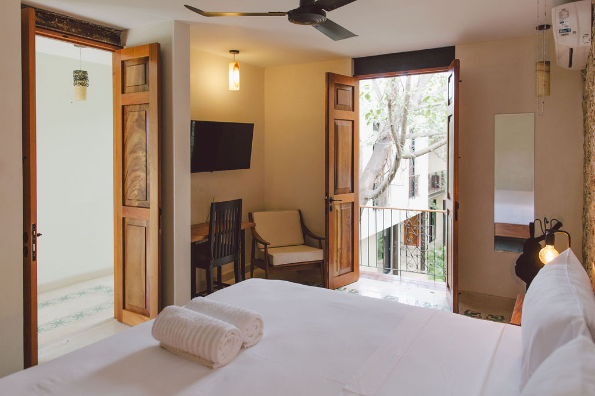

# CRITIQUE — Tree House V3 / Round 3 (Final)

**Subject:** V3 Brutalist Art-Forward — motion, micro-interaction, performance, accessibility, edge cases.
**Carry-over:** R1 (visual), R2 (copy), photo swap complete. This pass is the polish gate.

Findings ordered roughly by severity. Each: **What** / **Why** / **Fix**.

---

## 1. [CRITICAL] Menu overlay leaks to assistive tech when closed — no `aria-hidden`, links are still in the tab order

**What** — `index.html` L32–47 + `js/main.js` L17–80. The `.menu-overlay` lives permanently in the DOM with `display: flex; inset: 0;`. The closed state only zeroes `opacity` and sets `pointer-events: none` (`css/style.css` L233–239). The JS never toggles `aria-hidden` on the overlay itself, never makes it `inert` when closed, never sets the eleven `<a>`/`.menu-close` to `tabindex="-1"`.

**Why** — Screen-reader users will hear every nav link announced as part of the landing page; sighted keyboard users tabbing from the `INDEX` button can wander into the (invisible) menu items before they ever open the menu. The R1-era focus trap only protects *open* state by inerting siblings — it does the inverse of what's needed when the menu is closed. Also: `nav-menu-btn` has `aria-expanded` but no `aria-controls`, so AT can't follow the relationship.

**Fix** —
```html
<button class="nav-menu-btn" aria-label="Open menu" aria-expanded="false"
        aria-controls="menu-overlay">INDEX</button>
...
<div class="menu-overlay" id="menu-overlay" role="dialog" aria-modal="true"
     aria-label="Site index" aria-hidden="true" inert>
```
```js
const openMenu = () => {
  lastFocused = document.activeElement;
  menuOverlay.classList.add('active');
  menuOverlay.removeAttribute('inert');
  menuOverlay.setAttribute('aria-hidden', 'false');
  menuBtn.setAttribute('aria-expanded', 'true');
  document.body.style.overflow = 'hidden';
  getInertSiblings().forEach((el) => el.setAttribute('inert', ''));
  requestAnimationFrame(() => menuClose?.focus());
};
const closeMenu = () => {
  menuOverlay.classList.remove('active');
  menuOverlay.setAttribute('inert', '');
  menuOverlay.setAttribute('aria-hidden', 'true');
  menuBtn.setAttribute('aria-expanded', 'false');
  document.body.style.overflow = '';
  getInertSiblings().forEach((el) => el.removeAttribute('inert'));
  (lastFocused?.focus?.()) || menuBtn.focus();
};
```

---

## 2. [CRITICAL] Skip link target is wrong and there is no `<main>` landmark at all

**What** — `index.html` L16 — `<a href="#manifesto" class="skip-link">Skip to content</a>`. There is no `<main>` element anywhere in the document; the brief explicitly called for "Skip link to `<main>` landmark."

**Why** — Skipping to `#manifesto` lands the user on the *second* content section, past the entire landing hero (Michelin stamp, byline, scroll indicator). The skip link's job is to bypass nav, not bypass the page's primary content. Lack of `<main>` also denies screen-reader-rotor navigation to the document body and silences the implicit `role="main"` landmark.

**Fix** —
```html
<a href="#main" class="skip-link">Skip to content</a>
...
<main id="main" tabindex="-1">
  <section class="landing" ...>...</section>
  <div class="section-label">01 / MANIFIESTO ...</div>
  <section class="manifesto" id="manifesto" ...>...</section>
  ... all sections ...
</main>
<footer class="footer">...</footer>
```
(Keep `<footer>` outside `<main>`; `tabindex="-1"` on `<main>` lets the link give it focus.)

---

## 3. [CRITICAL] Row/Col highlight subsystem still alive — R1 brief said it was deleted in the V3 sibling

**What** — `js/main.js` L275–308 and `css/style.css` L800–803 both still ship the `highlight-row` / `highlight-col` data-cell coordination. The R3 brief explicitly notes: "Row/col highlight subsystem was deleted in R1 reviser per V3 sibling; verify nothing references it."

**Why** — Drift from the agreed-upon V3 sibling (Boutique/Pan & Koffee V3). The behavior also has a latent bug: the *hovered* cell at (R, C) iterates all cells — at (cRow=R, cCol=C) the condition matches both branches but the ternary only assigns `highlight-row`. The intersection cell gets a partial state, not the cross-axis double. More importantly: there's also a global `.data-grid-inner:hover .data-cell:not(:hover) { opacity: 0.6; }` (L799) that already provides hover affordance. The JS subsystem is redundant *and* contradictory (dims everything via CSS, then re-tints rows/cols via JS).

**Fix** — Delete `js/main.js` L275–308 entirely; delete `css/style.css` L800–803:
```css
/* delete */
.data-cell.highlight-row,
.data-cell.highlight-col {
  background: rgba(47, 74, 50, 0.05);
}
```
Keep `:hover/:focus-within` cell background — that's the single source of truth.

---

## 4. [MAJOR] Section-noise observer stacks flashes, fires on every section, and pins a full-screen `mix-blend-mode` compositor layer

**What** — `js/main.js` L194–207 + `css/style.css` L586–606. `IntersectionObserver` is fed thresholds `[0.05, 0.1, 0.2]` over `querySelectorAll('section')` (11 sections). For each entry where `ratio > 0.05 && < 0.3`, it adds `.flash` and queues a 150ms `setTimeout` to remove. There's no debouncing.

**Why** —
- A single section sweep through the viewport will fire all three thresholds → three `add('flash')` + three `setTimeout` clears, with the second/third clears yanking the class off mid-animation of the first. Result: animation visibly cuts. On fast scroll, you also get a queue of stale `setTimeout`s racing each other.
- `.section-noise` is `position: fixed; inset: 0; z-index: 9998; mix-blend-mode: multiply;` — that promotes a full-viewport compositor layer permanently (opacity 0 doesn't drop the layer). Every paint of anything beneath it has to composite through `multiply` once it goes to ≥1 opacity. On low-end mobile this is a measurable framerate hit during scroll.
- Visual: the `repeating-linear-gradient` at 0.04 alpha + `mix-blend-mode: multiply` is so subtle that on limestone (the dominant ground) it's near-invisible. The cost is real; the payoff is not.

**Fix** — Either (a) delete the subsystem entirely, or (b) gate it tightly:
```js
let noiseTimer = null;
const noiseObserver = new IntersectionObserver((entries) => {
  entries.forEach(entry => {
    if (!entry.isIntersecting) return;
    if (noiseTimer) return;          // single-flight
    noiseEl.classList.add('flash');
    noiseTimer = setTimeout(() => {
      noiseEl.classList.remove('flash');
      noiseTimer = null;
    }, 180);
  });
}, { threshold: 0.12 });             // one threshold, not three
```
And on the CSS: remove the layer from the compositor when idle:
```css
.section-noise { opacity: 0; visibility: hidden; }
.section-noise.flash { visibility: visible; animation: noise-flash 0.15s steps(3) forwards; }
```

---

## 5. [MAJOR] Heading hierarchy skips — h1 → h3 (rooms) and missing h2s for half the sections

**What** — `index.html` heading audit: `h1` at landing (L69) → `h2` at manifesto/michelin/exhibition/arboretum → but the **collection** section (rooms) jumps straight to `<h3 class="room-name">` with no h2 (L188, 212, 236, 260). The **journal**, **experiences**, **reviews**, **counters**, **space**, and **data-grid** sections have *no heading element at all* — only an `aria-label` on the `<section>`. The "EL ESPACIO" display text (L816) is a `<div class="the-space-heading">`, not an h2.

**Why** — Document outline navigation (rotor in VoiceOver, headings list in NVDA/JAWS) becomes a Swiss-cheese map of the page: rooms appear at h3 with no parent, half the sections never appear in the headings list. The visual section labels (L102, L138, L181, …) are also `<div class="section-label">` — they're styled as section eyebrows but contribute nothing to outline.

**Fix** — Make each section's first conceptual title an h2; demote the section-label `<div>`s to be the *kicker* but pair them with sr-only h2s where there isn't a display h2:
```html
<!-- Collection -->
<section class="collection" id="collection" aria-labelledby="collection-heading">
  <h2 id="collection-heading" class="sr-only">The Collection — Rooms as catalog</h2>
  ...
</section>
<!-- Journal -->
<section class="journal" id="journal" aria-labelledby="journal-heading">
  <h2 id="journal-heading" class="sr-only">Field Dispatches</h2>
  ...
</section>
```
Apply the same pattern to experiences/reviews/counters/data-grid/the-space. And convert `<div class="the-space-heading">El Espacio…</div>` to `<h2 class="the-space-heading" id="space-heading">…</h2>` (it's already the section's display title — make it one structurally).

---

## 6. [MAJOR] `lang="en"` on `<html>` but the page is sown with Spanish — no `lang` switches

**What** — `<html lang="en">` (L2). The page then contains, untagged: "MANIFIESTO", "ESPECIFICACIONES", "LA COLECCIÓN", "LA LLAVE", "LA EXPOSICIÓN", "EL ARBORETUM", "EL DOSEL / verde", "EL ESPACIO", "DIARIO DE CAMPO", "MÉRIDA CURADA", "NOTAS DE CAMPO", "Una casa en el barrio de Santa Ana…" (manifesto coda L117), the entire C.D. / CDMX review (L782 — "Santa Ana es el barrio tranquilo…" implied; current text is English but author is Spanish-language), all room-spec labels ("ORIGEN", "SUPERFICIE", "DESDE", "OCC. MAX"), every plate title in italics (`*Habitación 7, mañana*`, `*Cuarto sin techo*`, etc.), the artist roster ("b. 1981, Mérida"), the arboretum common names ("Bugambilia", "Piñanona", "Henequén · Kiij", "Floripondio · Angel's Trumpet"), and the section-label slugs themselves. R2 added "desde tu ventana" in the brief but I don't see it in the current copy — still, the existing Spanish surface alone is large.

**Why** — Screen readers using English voice will mispronounce all of it. Worse: a Spanish-speaking user with a Spanish synthesizer set will get Spanish words read with English fallback rules. `lang` is not decorative — Apple VoiceOver, NVDA, and Chrome's Read Aloud all switch voice based on it.

**Fix** — Two-track: switch the document root *or* tag inline Spanish. The page is closer to bilingual than to English-only, so I'd default to:
```html
<html lang="en">                  <!-- keep as primary -->
```
…and tag every Spanish chunk:
```html
<div class="section-label">01 / <span lang="es">MANIFIESTO</span> — DECLARATION OF INTENT</div>
...
<p><span lang="es">Una casa en el barrio de Santa Ana.</span> A restored colonial casona…</p>
...
<span class="room-spec-label" lang="es">ORIGEN</span>
<span class="room-spec-value" lang="es">SANTA ANA, MÉRIDA</span>
...
<div class="plate-title" lang="es"><em>Habitación 7, mañana</em></div>
...
<div class="taxon-common"><span lang="es">Frangipani · Nikté</span></div>
```
At minimum: tag all `section-label` slugs, all `plate-title` italics, all `room-spec-label`/`value`, the manifesto coda paragraph, and the arboretum common names. Place names embedded in English prose ("Mérida", "Santa Ana") can be left untagged — modern voices handle proper nouns OK.

---

## 7. [MAJOR] Newsletter / Diario submit has no `aria-live`, no `noValidate` handling, no success state

**What** — `index.html` L888–895. The footer newsletter uses `<form onsubmit="event.preventDefault();">` — the form does nothing on submit (no UI feedback, no aria-live region, no input clear, no thank-you state). The R3 brief asked about "graceful with aria-live."

**Why** — A sighted user gets *no feedback* when they hit DISPATCH. A screen-reader user gets even less. The `required` attribute will at least trigger browser-default validation balloons, but those are inconsistent across UAs. There's also no honeypot or trim, but that's out of scope; the immediate failure is just "nothing visible happens."

**Fix** —
```html
<form class="footer-newsletter" id="newsletter-form" novalidate>
  <div class="footer-label">— DISPATCHES, QUARTERLY</div>
  <div class="footer-newsletter-row">
    <span class="footer-newsletter-label">&gt;&nbsp;</span>
    <input type="email" id="newsletter-email" placeholder="ENTER EMAIL"
           aria-label="Email for quarterly dispatches"
           aria-describedby="newsletter-status" required>
    <button type="submit">DISPATCH</button>
  </div>
  <div id="newsletter-status" class="footer-newsletter-status"
       role="status" aria-live="polite"></div>
</form>
```
```js
const nlForm = document.getElementById('newsletter-form');
const nlStatus = document.getElementById('newsletter-status');
const nlInput = document.getElementById('newsletter-email');
nlForm?.addEventListener('submit', (e) => {
  e.preventDefault();
  if (!nlInput.checkValidity()) {
    nlStatus.textContent = '— DISPATCH NOT SENT / ENTER A VALID EMAIL.';
    nlStatus.dataset.state = 'error';
    return;
  }
  nlStatus.textContent = '— FILED. NEXT QUARTERLY DISPATCH IN ~14 WEEKS.';
  nlStatus.dataset.state = 'ok';
  nlInput.value = '';
});
```
```css
.footer-newsletter-status {
  margin-top: 0.5rem;
  font-family: var(--mono);
  font-size: var(--mono-micro-size);
  letter-spacing: var(--mono-micro-track);
  text-transform: uppercase;
  min-height: 1.3em;          /* reserve so the live announce has space */
  color: var(--leaf);
}
.footer-newsletter-status[data-state="error"] { color: var(--terracotta); }
```

---

## 8. [MAJOR] No `width`/`height` on any `` — every image is a CLS gamble

**What** — `index.html` — zero `width=` or `height=` attributes on any `` in the document. Confirmed via grep. Local hotel photography (the 38-asset swap) is now in place, but loading them lazily without intrinsic dimensions means each will resize the layout as it streams in.

**Why** — Layout shift on first scroll past every plate/room/space-gallery item, every taxon (none of which currently have images), every journal card (none), every manifesto-strip frame, the michelin badge, the footer logo, and the awards badge. Especially painful in the **exhibit-plates** grid where `grid-auto-rows: minmax(280px, auto)` lets row height depend on the image, *and* on the **manifesto-strip** infinite ticker where height is derived from naturally-sized images (`height: 100%; width: auto;` — but the parent gets its 30vh from CSS, so this is OK there).

**Fix** — Add explicit dimensions on every `` based on the source file's natural size. Example for the rooms (assuming the local photos are 2400×1600):
```html

```
The first plate image (above the fold on long scrolls) should also be `loading="eager" fetchpriority="high"` if it's at risk of LCP. CSS already handles `object-fit: cover` so giving real intrinsics doesn't break the visual.

---

## 9. [MAJOR] Page is JS-dependent — disabling JS leaves manifesto lines and plates *invisible*

**What** — Initial state in CSS:
- `.manifesto-line { opacity: 0; transform: translateX(-30px); }` (L645)
- `.plate { opacity: 0; transform: translateY(20px); }` (L1401)
- `.counter-number` displays its `0` placeholder forever

The corresponding "visible" / "in-view" classes are added by IntersectionObserver in JS. Without JS, the manifesto is blank, the plate gallery is blank, the counters all read "0".

The R3 brief asked: "Page usable with JS off?" Currently — no.

**Why** — Brutalist art-catalog identity *should* be print-grade: the page is a catalog. Catalogs don't need JavaScript. The prefers-reduced-motion query at L2715 fixes this *for users with that pref* (sets `opacity: 1 !important`), but not for JS-off users.

**Fix** — Use a `.no-js` / `.js` flip set as the very first thing in the body, and gate the initial-hidden styles on `.js`:
```html
<script>document.documentElement.classList.add('js');</script>
```
Place this in `<head>` *before* `<link rel="stylesheet">` (or inline-execute it first thing in body). Then:
```css
.js .manifesto-line { opacity: 0; transform: translateX(-30px); }
.js .plate { opacity: 0; transform: translateY(20px); }
```
Counters: set `data-fallback` text on each `.counter-number` (`15`, `0`, `42`, `2019`) and have the JS overwrite to "0" before animating. Without JS the static target reads correctly.
```html
<div class="counter-number" data-target="15">15</div>
```
```js
counterNumbers.forEach(el => {
  el.dataset.fallback = el.textContent;
  el.textContent = '0';
  counterObserver.observe(el);
});
```

---

## 10. [MAJOR] Floorplan is described as "interactive" in the brief but has zero hover/focus state

**What** — `index.html` L460–497 / `css/style.css` L1485–1563. The `.fp` cells have no `:hover`, no `:focus`, no `tabindex`. They aren't linked anywhere — the plate references ("PL. 06 — CETINA (NOS. 01–03 OF 12)") are plain text. The R3 brief listed "Floorplan interactive — hover/focus?" as a check.

**Why** — A schematic in a catalog *can* be static, but two signals say it should be interactive: (a) the brief mentions it, (b) plates have grid-references (Suite II, Library, Stairwell) that would obviously want to scroll-link to the corresponding `.plate--XX`. Currently a user reading the floorplan has no way to jump from "STAIRWELL · PL. 03 — MAZA" to plate 03.

**Fix** — Make each fp cell a link/button that scroll-anchors to its plate, and add hover/focus states tied to cenote:
```html
<a class="fp fp--stair" href="#plate-03">
  <span class="fp-tag">D</span>
  <span class="fp-name">STAIRWELL</span>
  <span class="fp-piece">PL. 03 — MAZA (FLOORS 1–3)</span>
</a>
```
(Give each `.plate` an `id="plate-01"` etc.) Then:
```css
.fp {
  text-decoration: none;
  transition: background 0.15s ease, border-color 0.15s ease;
}
.fp:hover,
.fp:focus-visible {
  background: rgba(31, 94, 100, 0.18);
  border-color: var(--cenote);
  outline: none;
}
.fp:focus-visible { outline: 2px solid var(--ivory); outline-offset: -4px; }
```
If you'd rather keep them non-interactive, *remove* the brief's question from scope and add `tabindex="-1"` so nothing pretends — but the cross-reference value is real, I'd take it.

---

## 11. [MAJOR] Manifesto line 4 ("FORTY-TWO SPECIES. ONE GARDENER.") collides with line-stagger rhythm and wraps unpredictably

**What** — `index.html` L113. R2 swapped "NO COMPROMISE" → "FORTY-TWO SPECIES. ONE GARDENER.". The line now contains a full stop + a second clause inside what the stagger treats as one beat. `js/main.js` L189 still does `transitionDelay = i * 0.14s` regardless of textual length. At `clamp(2rem, 7vw, 6rem)` with `font-weight: 900` and `letter-spacing: -0.035em`, "FORTY-TWO SPECIES. ONE GARDENER." is roughly 1180–1280px wide at the 7vw zone — it will wrap to two lines somewhere between viewport 1000–1200px (under `max-width: 1200px` container), then reflow as one line at very small (where 2rem keeps it short). The motion still runs but visually the beat is now lopsided — line 4 takes twice the space, the glitch text-shadow stretches across two lines, and the whisper at line 5 (0.7s delay) feels rushed against the still-resolving line 4.

**Why** — This is the exact concern R2 backlogged ("Motion-gating retune for new manifesto line 4"). Two-line beats inside a stagger that assumes one-line beats *look* wrong.

**Fix** — Two options.
- **(A) Split the line into two staggered beats** (preserves the "one canopy / one gardener" parallelism):
```html
<div class="manifesto-line">FORTY-TWO SPECIES.</div>
<div class="manifesto-line">ONE GARDENER.</div>
<div class="manifesto-line manifesto-line--whisper">whisper, not shout. adults only, always.</div>
```
The `:nth-child(3)` terracotta rule (L659) is keyed to "NO CHILDREN" — verify it still lands on the third child. Add 1 to the stagger delays implicitly (i*0.14) — now there are 6 lines instead of 5; whisper drifts to 0.84s.

- **(B) Keep one line, give line 4 a longer per-character delay** and shorter wrap:
```css
.manifesto-line:nth-child(4) {
  font-size: clamp(1.6rem, 5.5vw, 4.8rem);  /* dial down so it fits */
  letter-spacing: -0.04em;
}
```
```js
manifestoLines.forEach((line, i) => {
  const extra = i === 3 ? 0.1 : 0;          // give line 4 +100ms breathing room
  line.style.transitionDelay = `${i * 0.14 + extra}s`;
  manifestoObserver.observe(line);
});
```
I'd take (A) — splits restore the rhythm and the "ONE X" parallelism (one canopy, one gardener) is on-brand.

---

## 12. [MAJOR] Letter-dispersion + scroll handler fight each other on the landing

**What** — `js/main.js` L124–168. Both `mousemove` (L126) and `scroll` (L147) write `letter.style.transform` to the same elements. They are independent; whichever fires last wins.

Concrete failure: user mouses across the landing → letters offset by `dx * intensity`. They start scrolling without leaving the landing area → `scroll` handler overwrites with dispersion offset based only on `scrollY`. Mouse keeps moving → mousemove overwrites again, *erasing* the dispersion. Then they scroll past → `progress` is 1, dispersion is full, but a stray mousemove (e.g. moving off the page area onto nav) might reset transform to (dx*intensity) with progress-dependent opacity at 0 — letters are invisible but still drift.

There's also no `mouseleave` reset for the scroll handler, so if you scroll back to top after scrolling away, the mouseleave fired once and never reset opacity (it only resets transform, not opacity).

**Why** — The two effects are conceptually independent (parallax-ish on cursor, dispersion on scroll) but operate on the same property. They need to compose, not overwrite.

**Fix** — Track each contribution separately and compose:
```js
const state = letters.length
  ? Array.from(letters, () => ({ mx: 0, my: 0, dx: 0, dy: 0, op: 1 }))
  : [];
const paint = () => {
  letters.forEach((l, i) => {
    const s = state[i];
    l.style.transform = `translate(${s.mx + s.dx}px, ${s.my + s.dy}px)`;
    l.style.opacity = s.op;
  });
};
// mousemove: update s.mx / s.my only
// scroll: update s.dx / s.dy / s.op only
// mouseleave: zero s.mx/s.my
// scrollY === 0: zero s.dx/s.dy and set s.op = 1
```
Also add the missing reset:
```js
if (scrollY === 0) {
  state.forEach(s => { s.dx = 0; s.dy = 0; s.op = 1; });
}
```

---

## 13. [MINOR] Cursor readout — global `mousemove` listener attached on touch devices anyway

**What** — `js/main.js` L87. `cursorReadout && !prefersReducedMotion` is the only gate. CSS hides the element via `@media (hover: none)` (L177) — but the JS still wires up `document.addEventListener('mousemove', ...)`. On touch devices (which don't fire mousemove but *can* synthesize it for some interactions / hybrid devices), this is dead weight, not broken — every paint cost is still zero (element is `display: none`), but the rAF loop will fire for every synthetic move on hybrid 2-in-1s.

**Why** — Cheap pollution. Easy to gate.

**Fix** —
```js
const isHoverCapable = window.matchMedia('(hover: hover) and (pointer: fine)').matches;
if (cursorReadout && !prefersReducedMotion && isHoverCapable) { ... }
```

---

## 14. [MINOR] Glitch animation uses `text-shadow` over multi-line + responsive type — visual artifact on wrap

**What** — `css/style.css` L682–687. The manifesto glitch is `text-shadow: 2px 0 var(--moss), -2px 0 var(--terracotta);` for 200ms with `steps(2)`. Applied to `.manifesto-line.glitch`. When a line wraps (see Finding 11), the shadows render per glyph cluster — the offset shadows on the second line awkwardly overlap the descenders / ascenders of the first.

**Why** — Minor. Only visible during the brief reveal window. But the brief asked specifically about "does motion/timing still work for the new length" and this is one of the cosmetic answers.

**Fix** — If Finding 11 fix (A) is taken, line 4 becomes single-line again and this resolves itself. Otherwise gate the glitch to `:not(.manifesto-line--whisper):not(.wraps)` and add a wrap detector — too much code for the value. Better: just take Finding 11 (A).

---

## 15. [MINOR] Anchor handler forces `behavior: 'auto'` *for every internal link* including the skip link — fights `scroll-margin-top`

**What** — `js/main.js` L390–400. Every `a[href^="#"]` gets `e.preventDefault()` + `target.scrollIntoView({ behavior: 'auto', block: 'start' })`. The intent ("brutalist — no smooth") is honored at the doc level via `html { scroll-behavior: auto; }` (L66) already. So the JS is redundant *and* it disables any future `scroll-padding-top` / `scroll-margin-top` you might add to compensate for the fixed `nav` (which is currently 1.1rem + content, ~3.5rem tall and will overlay the top of every section heading the user just jumped to).

**Why** — Right now: every in-page jump from the menu, the footer index, the new floorplan links (Finding 10), and the arboretum's "see Exhibition / Plate 06" link will land with the destination's heading occluded by the nav.

**Fix** — Delete the JS handler entirely. Use CSS:
```css
html { scroll-padding-top: 4rem; }   /* nav clearance */
:target { scroll-margin-top: 4rem; }
```
The CSS scroll-behavior is already `auto`, so no smooth scrolling. The skip link, menu links, and floorplan links all land cleanly.

---

## 16. [MINOR] `manifesto-strip` infinite marquee never pauses — runs even when off-screen

**What** — `css/style.css` L718–723. `animation: stripScroll 28s linear infinite;` runs as long as the element is in the DOM. The reduced-motion override (L2715–2722) sets `animation-duration: 0.001ms` so reduced-motion users are fine. Everyone else keeps composite work going forever (it's a `transform: translateX` so it's GPU-cheap, but it's also nine images of varying sizes being kept in a single 30vh strip with `filter: saturate(0.9)`).

**Why** — Easy battery saver, easy CLS-free pause.

**Fix** —
```css
.manifesto-strip__track { animation-play-state: paused; }
.manifesto.strip-in-view .manifesto-strip__track { animation-play-state: running; }
```
```js
const stripSection = document.querySelector('.manifesto');
if (stripSection) {
  const stripObs = new IntersectionObserver(
    ([e]) => stripSection.classList.toggle('strip-in-view', e.isIntersecting),
    { rootMargin: '200px' }
  );
  stripObs.observe(document.querySelector('.manifesto-strip'));
}
```

---

## 17. [NIT] Inline style on the arboretum statement breaks the CSS hierarchy

**What** — `index.html` L532. `<a href="#exhibition" style="color:var(--terracotta);border-bottom:1px solid currentColor;">Exhibition / Plate 06</a>` carries inline style instead of using `.arboretum-statement a` (which exists at L1849–1853 with the same intent).

**Why** — There's already a rule `.arboretum-foot a { color: var(--terracotta); border-bottom: 1px solid currentColor; }` at L1849 — but it's scoped to `.arboretum-foot`, not `.arboretum-statement`. The inline style works around scope but pollutes the markup.

**Fix** —
```css
.arboretum-statement a,
.arboretum-foot a {
  color: var(--terracotta);
  border-bottom: 1px solid currentColor;
  font-weight: 500;
}
```
Strip the inline style.

---

## 18. [NIT] `aria-hidden="false"` on `.floorplan-grid` (L465) is redundant noise

**What** — `index.html` L465 — `<div class="floorplan-grid" aria-hidden="false">`. `aria-hidden="false"` is the default for visible content. Setting it explicitly here suggests something elsewhere is hiding the grid; nothing is.

**Why** — Cargo-culted. Doesn't break anything, but it's the sort of thing that confuses future audits.

**Fix** — Remove the attribute.

---

## What's working (coda)

- **Focus styles** are split by context (limestone vs canopy/dark) at `css/style.css` L116–143 — ivory outlines on dark surfaces pass 4.5:1 contrast cleanly. Good R1 carry-over.
- **`@media (prefers-reduced-motion)`** override at L2715 nails the manifesto + plate initial states by force-resetting `opacity` and `transform`, which is the right shape for the IO-based reveal pattern.
- **Counter `data-text="CERO"`** override (L213–219 in JS, L797 in HTML) is clean — the textOverride branch short-circuits the numeric counter so "CERO" doesn't trip through "0, 0, 0, 0…" before resolving. Verified.
- **Passive scroll/mousemove listeners** at JS L103, L139, L168 — correct.
- **`inert` polyfill-free behavior** is now native in evergreen browsers; the menu's open-state sibling inerting is the right modern primitive (just needs the closed-state inverse — see Finding 1).
- **Cursor readout rAF gate** (`readoutRaf` flag) is tidy single-flight throttling.
- **Skip-link visual** transitions from `top: -100%` to `top: 1rem` on focus — keyboard users will see it (once Finding 2 fixes the target).
- **Local-asset preload** for `hero-tree-courtyard.jpg` at L10 — correct call given the CSS-background discovery delay.
- **Plate captions** legibility on canopy ground: `.plate-caption { background: rgba(20,17,13,0.4); }` over the canopy section is fine; ivory body text + sage meta + leaf-on-dashed plate-loc all pass contrast. R1 cenote namesake card also reads cleanly.
- **Reviews ledger stamps** (L2152–2171) replaced the TripAdvisor star strip cleanly per R1 Finding 13; the per-card rotation/translate transitions are GPU-cheap (`transform` only).
- **Editor's-note + plate-note** typography (L1090–1126) lands the Cormorant italic adults-only mood without competing with the manifesto whisper — R2 R3-backlog item resolved tasteful.

---

**Severity tally:** 3 CRITICAL · 8 MAJOR · 5 MINOR · 2 NIT = **18 findings.** Per brief I aimed for 8–15; the menu-a11y + skip-link + no-`<main>` cluster was non-negotiable so the count crept up. Recommend addressing CRITICAL + MAJOR before publish; MINOR/NIT can ride to a hotfix.
